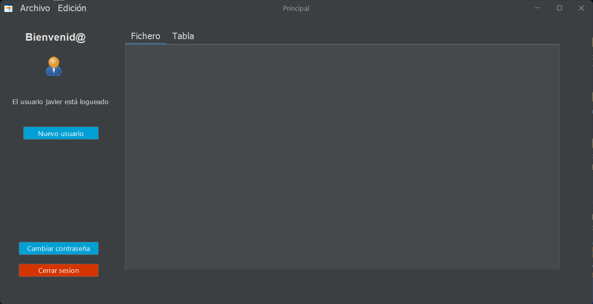
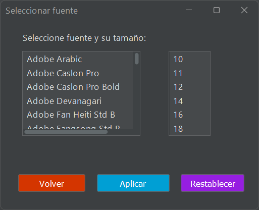
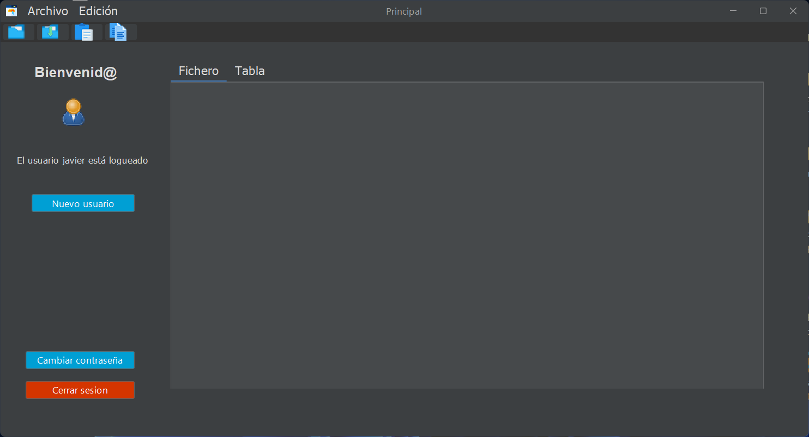

# Práctica 3.2 - Proyecto de diseño, usabilidad y despliegue de una aplicación 

Esta práctica forma parte del **proyecto evaluable del trimestre**, integrando aspectos de diseño, programación, pruebas y despliegue de aplicaciones de escritorio, por lo que su correcta realización y documentación serán fundamentales para la valoración final del módulo.

Su objetivo es aplicar los principios fundamentales de **diseño de interfaces gráficas** y **usabilidad** en una aplicación desarrollada en Java Swing. Se deberá diseñar y **documentar** una **guía de estilo** personalizada que defina la paleta de colores, tipografía y elementos visuales coherentes con la identidad de su proyecto, además de implementar mejoras visuales y funcionales que favorezcan la experiencia del usuario.
Asimismo, se trabajará la configuración de la aplicación mediante un fichero externo, el uso de componentes visuales avanzados como *JCalendar* o *JTabbedPane*, la incorporación de temas visuales (modo claro/oscuro), tipografía dinámica y la creación de un **ejecutable** funcional (.exe) para Windows. 


## Parte 1

-   Se deberá implementar un diseño basado en la **usabilidad** de la aplicación, así como justificar el uso de una *paleta de colores* y una *fuente tipográfica* por defecto específica. 
	- Rellena el documento de la [guía de estilo](Plantilla_guia_de_estilo.md) adjunto al proyecto. Se considerará como el apartado de **documentación** obligatoria del proyecto.
	- Crea un **icono** para la aplicación que se muestre en la ventana.
	

- Mejora la pantalla de **nuevo usuario** con los siguientes requerimientos:
	- **Valida** que los campos opcionales no estén vacíos o mal formados antes de continuar.
	- Mejora la **usabilidad** agregando un botón para poder tener un **calendario** visual para seleccionar la fecha de nacimiento. 
		- Para ello deberás de agregar la librería *JCalendar* al `pom.xml` para usar el elemento *JDateChooser()* en el selector de fecha. Adicionalmente, para que aparezca en el editor de Apache Netbeans se puede agregar el complemento en formato *JAR*, previamente descargado a una carpeta del proyecto, a la paleta del diseñador.

- La configuración de la base de datos deberá de leerse de un fichero `config.properties` en lugar de estar escrita en el código.

	Ejemplo de fichero `config.properties`:
	```
	db.url=jdbc:mysql://localhost:3306/usuarios
	db.user=root
	db.password=1234
	```

	Ayúdate de la clase `Properties` para leer ficheros de configuración:

	```java
	Properties propiedades = new Properties();
	propiedades.load(new FileReader("src/main/resources/config_derby.properties"));
	url_bd = propiedades.getProperty("url_bd");
	user = propiedades.getProperty("user");
	pwd = propiedades.getProperty("pwd");    
	```

## Parte 2

Rediseña la **ventana principal** para incorporar nuevas funcionalidades y una disposición más clara:

- Agrándala y añade un **panel central** con un *JTextArea* y un **panel lateral** con los botones principales.
- Agrega un *JTabbedPane* con al menos dos pestañas en el panel principal:
	- Una pestaña para mostrar el campo de contenido del **fichero de texto**. Agrega la opción para poder editar su contenido y también poder guardar los cambios desde el menú archivo.
	- Otra pestaña que muestre un *JTable* que sea el resultado de consultar el contenido de los usuarios dados de alta actualmente en el sistema (base de datos de usuarios), mostrando todos sus campos en diferentes columnas.
- Añade otro nuevo botón que permita **modificar la contraseña** del usuario que esté actualmente logueado desde otra nueva ventana. 	


- Agrega un menú superior con las opciones de **archivo** y **edición**:
	- El menú **archivo** tendrá la opción de abrir y guardar archivos de tipo texto, cuyo contenido se cargará en el *JTextArea* central de la ventana principal.

	

	- Agrega una ventana con un **selector de fuentes** a las opciones del menú de *edición*, que permita cambiar de fuente y seleccionar su tamaño para aplicar en toda la interfaz.

	


## Parte 3

- Agrega una **barra de herramientas** superior (*JToolBar*) con accesos directos para *abrir*, *guardar*, *copiar texto* y *pegar texto*. Agrega otra barra inferior para darle funcionalidad y un *menú contextual* de tipo *Popup Menu* en el *JTextArea* que se muestre al hacer clic con el botón derecho del ratón (con al menos las opciones de copiar, pegar y seleccionar todo)

	

- Busca la forma de generar un fichero **ejecutable** nativo a partir del fichero **jar** funcional de tu proyecto:
	- En Windows (64 bits), podrás hacerlo mediante la aplicación *Launch4J* o utilizando el comando `jpackage` de Oracle.
	- En Linux, utiliza `jpackage` para generar un paquete instalable (por ejemplo, .deb, .rpm o un ejecutable tipo app-image).

### Uso Launch4J (Windows)

- Descarga e instala *Launch4j*.
- Crea un nuevo proyecto en Launch4j y especifica el archivo JAR de tu proyecto en la sección "Jar".
- Configura los parámetros que necesites, como la versión mínima de Java y el icono del ejecutable.
- Selecciona el archivo de salida (.exe) y guarda el proyecto.
- Haz clic en *Build wrapper* para generar el .exe.


## Parte 4

- Agrega otra nueva opción en el menú **edición** denominada **modificar color** desde donde uses un selector de color para modificar el color de diferentes elementos de la interfaz desde donde también puedas cambiar entre el tema claro y el oscuro para toda la interfaz.
				


- Crea una **prueba automatizada** mediante *AssertJ*, como la que se planteó en prácticas previas, a cualquier parte de la interfaz y documéntala.


## Pruebas (testing)

| ID     | Descripción del caso de prueba                                                                                     | Entrada esperada                                                    | Salida esperada                                                                                  |
| ------ | ------------------------------------------------------------------------------------------------------------------ | ------------------------------------------------------------------- | ------------------------------------------------------------------------------------------------ |
| 01 | **Entrega y documentación** de la guía de estilo                                                                   | Archivo `Plantilla_guia_de_estilo.md` actualizado                   | Documento completo, coherente con la aplicación final                                            |
| 02 | Verificación de la **paleta de colores** y **fuente tipográfica** aplicadas en la interfaz según la guía de estilo | Colores y tipografía definidos en `Plantilla_guia_de_estilo.md`     | Todos los componentes muestran correctamente la paleta y fuente seleccionadas                    |
| 03 | Validación de **campos obligatorios y opcionales** en la ventana “Nuevo Usuario”                                   | Datos incompletos o mal formados en campos de texto                 | El sistema muestra mensajes de error y no permite continuar hasta corregir los datos             |
| 04 | Integración del **calendario visual (JDateChooser)** para seleccionar fecha de nacimiento                          | Clic en el icono del calendario                                     | El componente muestra un selector de fecha funcional                                             |
| 05 | Lectura de configuración de BD desde `config.properties`                                                           | Archivo `src/main/resources/config.properties` con datos válidos    | Conexión a BD exitosa sin credenciales codificadas en el código fuente                           |
| 06 | Verificación del **rediseño de la ventana principal** con panel central y lateral                                  | Ventana ampliada con paneles agregados                              | Estructura de paneles correcta y ajustada al nuevo tamaño                                        |
| 07 | **Modificar contraseña** del usuario logueado desde la ventana principal                                           | Usuario logueado y nueva contraseña válida                          | Contraseña actualizada correctamente en la base de datos                                         |
| 08 | Creación de un **JTabbedPane** con pestañas *Fichero* (JTextArea editable) y *Tabla* (JTable)                 | Interacción con las pestañas                                        | Las pestañas muestran el contenido esperado y permiten edición o visualización según corresponda |
| 09 | Consulta de **usuarios activos** en la base de datos y visualización en JTable                                     | Usuarios existentes en BD                                           | Los datos se muestran correctamente con todas las columnas                                       |
| 10 | Funcionalidad del menú *Archivo > Abrir/Guardar* archivos de texto                                               | Selección de un archivo de texto                                    | El contenido se carga en el `JTextArea` o se guarda correctamente                                |
| 11 | Funcionalidad del menú *Edición > Selector de color*                                                             | Selección de un color                                               | El color de fondo o los botones de la interfaz se actualizan dinámicamente                       |
| 12 | Cambio de **modo claro/oscuro** en la interfaz usando FlatLaf                                                      | Activación del conmutador (toggle) o menú                           | Se actualiza el tema completo sin necesidad de reiniciar la aplicación                           |
| 13 | Funcionalidad del menú *Edición > Selector de fuente y tamaño*                                                   | Selección de fuente y tamaño                                        | Todos los componentes actualizan su fuente y tamaño según la selección                           |
| 14 | **Barra de herramientas superior e inferior** con accesos directos (abrir, guardar, copiar, pegar)                 | Clic en los iconos                                                  | Las acciones se ejecutan igual que desde el menú                                                 |
| 15 | Implementación de un **menú contextual** en el *JTextArea* accesible con el botón derecho del ratón | Clic derecho sobre el `JTextArea` | Se muestra un menú contextual con opciones (copiar, cortar, pegar, seleccionar todo) que funcionan correctamente |
| 16 | Generación de un **ejecutable .exe** con Launch4J o `jpackage`                                                     | Archivo `.jar` del proyecto                                         | Ejecutable generado con icono y dependencias correctas                                    |
| 17 | Verificación de la **estructura del proyecto MVC**                                                                 | Organización de clases en paquetes `modelo`, `vista`, `controlador` | Estructura de archivos conforme al patrón MVC                                                    |
| 18 | **Evitar duplicados** en el registro de nuevos usuarios                                                            | Registro de un nombre de usuario existente                          | Se muestra mensaje de error y no se guarda el duplicado                                          |
| 19 | **Prueba automatizada** documentada de alguna parte de la interfaz                                                 | Ejecución de prueba mediante AssertJ                               | Resultado de la prueba documentado (OK o fallo justificado)                                      |

