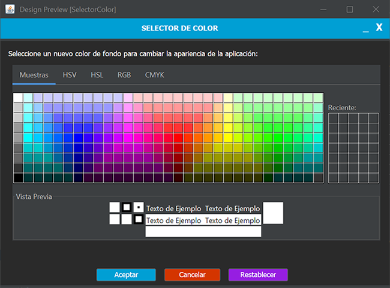

# Práctica 3.2 Usabilidad básica (guía de estilo) e instalación

La práctica consiste en crear una **guía de estilo** para tu aplicación y rellenanr un documento adjunto para seguir algunas de las reglas básicas de **usabilidad** vistas. Deberás de personalizar y reorganizar su diseño, la barra superior y mediante paneles las distintas ventanas para darle así un aspecto visual más acorde y actual:

## Parte 1

-   Se deberá implementar un diseño basado en la **usabilidad** de la aplicación, así como justificar el uso de una *paleta de colores* y una *fuente tipográfica* por defecto específica. 
	- Rellena el documento de la [guía de estilo](Plantilla_guia_de_estilo.md) adjunto al proyecto.
	- Crea un **icono** para la aplicación que se muestre en la ventana.
	

- Mejora la pantalla de **nuevo usuario** con los siguientes requerimientos:
	- **Validar** también que los campos opcionales no estén vacíos o mal formados antes de continuar.
	- Mejorar la **usabilidad** agregando un botón para poder tener un **calendario** visual para seleccionar la fecha de nacimiento. 
		- Para ello deberás de agregar la librería *JCalendar* al `pom.xml` para usar el elemento *JDateChooser()* en el selector de fecha. Adicionalmente, para que aparezca en el editor de Apache Netbeans has de agregar el complemento en formato *JAR*, previamente descargado a una carpeta del proyecto, a la paleta del diseñador.

- La configuración de la base de datos deberá de leerse de un fichero `config.properties` en lugar de estar escrita dentro del código.

	Ejemplo de fichero `config.propierties`:
	```
	db.url=jdbc:mysql://localhost:3306/usuarios
	db.user=root
	db.password=1234
	```

	Ayúdate de la clase `Propierties` para leer ficheros de configuración:

	```java
	Properties propiedades = new Properties();
	propiedades.load(new FileReader("src/main/resources/config_derby.properties"));
	url_bd = propiedades.getProperty("url_bd");
	user = propiedades.getProperty("user");
	pwd = propiedades.getProperty("pwd");    
	```

## Parte 2

Rediseña la **ventana principal** para que a partir de ahora se le añada contenido y nuevas funcionalidades:
- Agrándala y agrégale un gran panel central con un *JTextArea* y otro lateral con los botones. 
- Agrándala agrégale un gran *JTabbedPane* con al menos dos pestañas en el panel principal:
	- Una pestaña para mostrar el campo de contenido del fichero de texto. Agrega la opción para poder editar su contenido y también poder guardar los cambios desde el menú archivo.
	- Añade otra pestaña que muestre un *JTable* que sea el resultado de consultar el contenido de los usuarios dados de alta actualmente en el sistema, mostrando todos sus campos en diferentes columnas.
- Añade otro nuevo botón que permita **modificar la contraseña** del usuario que esté actualmente logueado. 
- Agrega un menú superior con las opciones de **archivo** y **edición**:
	- El menú **archivo** tendrá la opción de abrir y guardar archivos de tipo texto cuyo contenido se cargará en el *JTextArea* central de la ventana principal.
	- Agrega un **selector de color** a las opciones del menú de edición, cuya función sea cambiar el color de los botones de la interfaz y variar entre modo oscuro y modo claro.
		
	- Agrega un **selector de fuentes** que permita cambiar de fuente y seleccionar su tamaño.


## Parte 3

- Agrega una **barra superior** con accesos directos y otra inferior para darle funcionalidad y usabilidad.

- Crea una **prueba automizada** a cualquier parte de la interfaz y documéntala.

- Busca la forma de generar un **ejecutable** para *Windows_64* usando el fichero **jar** generado de tu proyecto usando la aplicación *Launch4J* o mediante el comando `jpackage` de Oracle. 

### Launch4J 

- Descarga e instala *Launch4j*.
- Crea un nuevo proyecto en Launch4j y especifica el archivo JAR de tu proyecto en la sección "Jar".
- Configura los parámetros que necesites, como la versión mínima de Java y el icono del ejecutable.
- Selecciona el archivo de salida (.exe) y guarda el proyecto.
- Haz clic en *Build wrapper* para generar el .exe.

Puede seguir los pasos desde el siguiente tutorial desde [este enlace.](https://www.raulprietofernandez.net/blog/programacion/como-crear-un-instalador-para-aplicaciones-java-con-install4j)


## Mejoras opcionales (evaluable)

Agrega otra opción en el menú **edición** para cambiar el tipo de fuente y el tamaño y que afecte a toda la interfaz.

Busca la forma de mejorar el selector de color por defecto utilizado, ya sea en repositorios u otras clases en Internet. Haz lo mismo con el selector de ficheros por defecto.

Investiga la forma de integrar el funcionamiento de la Base de Datos de tu aplicación mediante el instalador.

## Pruebas (testing)

| ID Caso Prueba | Descripción Caso de Prueba                                                                                               | Entrada esperada                                                                          | Salida esperada                                                                                      |
|----------------|--------------------------------------------------------------------------------------------------------------------------|-------------------------------------------------------------------------------------------|-------------------------------------------------------------------------------------------------------|
| 01             | Verificación de la paleta de colores y la fuente tipográfica aplicadas en la interfaz                                     | Colores y tipografía predefinidos en la guía de estilo                                     | Colores y fuente aplicados correctamente en todos los componentes                                      |
| 02             | Sustitución de la barra superior por una barra personalizada                                                             | Uso de `JFrame.setUndecorated(true)`                                                      | La barra superior personalizada aparece correctamente                                                 |
| 03             | Validaciones de los campos opcionales de la ventana nuevo usuario               | Texto de los diferentes campos     | Si falta texto en alguno de los campos obligatorios no podrá continuar                  | OK/No cumple|
| 04             | Verificación del aumento de tamaño de la ventana principal con panel central y lateral                                   | Tamaño de ventana agrandado y paneles agregados                                            | Ventana principal correctamente redimensionada con los paneles añadidos                                |
| 05             | Añadir menú superior con opciones de "Archivo" y "Edición"                                                               | Menú añadido con opciones                                                                  | El menú superior con las opciones se muestra correctamente                                             |
| 06             | Funcionalidad para abrir y guardar archivos de texto desde el menú "Archivo"                                              | Archivo de texto seleccionado                                                             | Contenido del archivo cargado o guardado en el `JTextArea`                                              |
| 07             | Verificación de funcionalidad del selector de color en el menú "Edición"                                                  | Selección de un color en el selector                                                      | Color de fondo del `JPanel` y de toda la interfaz cambiado correctamente                                    |
| 08             | Mover las ventanas desde la barra superior personalizada                                                                 | Intento de mover la ventana desde la barra personalizada                                   | La ventana se puede mover desde la barra superior personalizada y funcionan sus acciones cerrar y mininizar                                       |
| 09             | Generación de un ejecutable de Windows_64 con `Launch4J` o `jpackage`                                                      | Archivo `jar` del proyecto                                                                 | Ejecutable `.exe` generado correctamente con un icono asociado                                                              |
| 10             | Se adjunta el documento de plantilla de estilo correctamente cumplimentado                                                                                  |   `Plantilla_guia_de_estilo.md`                         | Se modifica y adjunta la nueva guía de estilo que se corresponde con la aplicación                                      |
| 11             | Validaciones de los campos opcionales de la ventana nuevo usuario               | Texto de los diferentes campos     | Si falta texto en alguno de los campos obligatorios no podrá continuar                  | OK/No cumple|
| 12             | Agregar un componente de calendario a través de una librería JAR         | N/D     | Se muestra un calendario al hacer clic en su icono                      | OK/No cumple|
| 13             | Mejora del selector de color predeterminado                                                                              | Uso de un selector de color personalizado                                                  | El nuevo selector de color reemplaza el predeterminado y ofrece más opciones                           |
| 14             | Mejora del selector de archivos predeterminado                                                                           | Uso de un selector de archivos personalizado                                               | El nuevo selector de archivos reemplaza el predeterminado y ofrece más funcionalidad                   |
| 15             | Integración de la Base de Datos en el instalador                                                                         | Configuración del instalador con los parámetros de la base de datos                        | La base de datos se integra y configura automáticamente durante la instalación                         |
| 16             | Estructura del proyecto                        | N/D   | Se utiliza la división por paquetes MVC; VistaControlador y Modelo para organizar las clases usando el modelo de objetos de forma apropiada | OK/No cumple|
| 17             | Comprobación fichero jar                        | Proyecto a empaquetar   | Se genera y prueba el fichero jar empaquetado | OK/No cumple|
| 18             | Verificación de duplicados en la BD                          | Agregar un nuevo usuario   | Se verifica que el nombre de usuario no exista ya en la BD | OK/No cumple|
| 19             | Leer datos de la BD de un fichero llamado `config.properties`                          | N/D   | Se leen los datos de conexión de la BD de dicho fichero y no del código fuente | OK/No cumple|