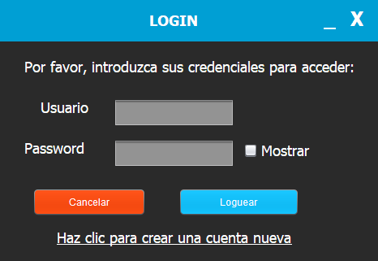

# Práctica 3.1 Usabilidad básica y guía de estilo de la aplicación

## Parte 1

La práctica consiste en utilizando una **guía de estilo** y siguiendo algunas de las reglas básicas de **usabilidad** vistas, personalizar y reorganizar mediante paneles las ventanas de la aplicación desarrollada previamente:

-   Se deberá de utilizar *JPanels* sobre la ventana y como **layouts** el *Free Design* para la ventana principal y el *Null Layout* para los JPanels.
-   Se deberá hacer un estudio de la **usabilidad** de la aplicación (especialmente la parte de creación de usuarios nuevos), así como justificar el uso de una *paleta de colores* específica y el de una *fuente tipográfica* específica. Rellena el documento de la **guía de estilo** adjunto al proyecto.
-   La **barra superior** de las ventanas deberá de ser sustituida por barras personalizadas creadas por nosotros, que tengan su misma funcionalidad (excepto por el momento mover ventana).

    

## Parte 2

Mejora el ejercicio anterior permitiendo **mover** todas las ventanas desde su *JPanel* personalizado.

Rediseña la **ventana principal**:

- Agrandándala y agrégale un gran panel central con un *TextArea* y otro lateral con los botones. Agrega una barra inferior de estado con funcionalidad. 
- Agrega un menú superior con las opciones de **archivo** y **edición**.
	- El menú archivo tendrá la opción de abrir y guardar archivos de tipo texto cuyo contenido se cargará en el TextArea central de la ventana principal.
	- Agrega un **selector de color** a las opciones del menú creado anteriormente, cuya función sea cambiar el color de fondo de los JPanel y de toda la interfaz.

## Parte 3

Busca la forma de generar un **ejecutable** para *Windows_64* usando el fichero jar generado. Agrégale un **icono** a tu aplicación.

Crea un instalador para tu aplicación usando el programa *installa4j* siguiendo el tutorial desde el [siguiente enlace.](https://www.raulprietofernandez.net/blog/programacion/.como-crear-un-instalador-para-aplicaciones-java-con-install4j)

Opcional: Busca la forma de mejorar el selector de color por defecto utilizado, ya sea en repositorios u otras clases en Internet. Haz lo mismo con el el selector de ficheros por defecto.
